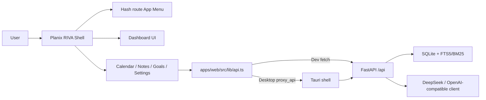

<p align="center">
  <br>
  <strong>Planix</strong>
  <br>
  <span>AI planning OS · daily review loop · local RAG · Windows desktop app</span>
  <br><br>
  
  
  
  
  
</p>

## 中文介绍

**Planix** 是一个面向学习、求职和长期目标管理的 AI 规划系统。它把长期目标、每日计划、资料库、AI 拆解、复盘重排和质量评测收束到一个 RIVA 风格的 AI OS Shell 中。

当前阶段只把前端展示品牌从 MyNotes 升级为 Planix；后端 API、数据库路径、localStorage key、`mynotes-api` sidecar 和 MSI 文件名仍保持兼容，不做破坏性重命名。

## English

**Planix** is an AI planning system for learning, job search, and long-term goal execution. It combines calendar planning, goal decomposition, daily review, replan preview, local RAG material Q&A, and planner evaluation in a RIVA-style AI OS shell.

This phase renames the frontend product experience from MyNotes to Planix. Internal compatibility names such as API paths, database paths, localStorage keys, the `mynotes-api` sidecar, and MSI artifact names are intentionally unchanged.

## Current Status

| Item | Status |
| --- | --- |
| Version | `1.1.4` |
| Frontend | React 18 + TypeScript + Vite |
| UI shell | Planix RIVA AI OS Shell with hash route and i18n |
| Backend | FastAPI + SQLite |
| RAG | SQLite FTS5/BM25 with citations |
| AI | DeepSeek-first OpenAI-compatible client with mock fallback |
| Desktop | Tauri v2 + `mynotes-api.exe` sidecar |
| Installer | `release/MyNotes-AI-v1.1.4-windows-x64.msi` |
| Next | Desktop polish, updater, signing, and portfolio presentation |

## Features

| Module | Description |
| --- | --- |
| RIVA Dashboard | Default AI OS workspace with Agent input, output, cards, and read-only Inspector |
| App Menu | Top-left collapsible menu for Dashboard, Calendar, Notes, Goals, and Settings |
| i18n | Chinese / English switching without page refresh, persisted in localStorage |
| Calendar | Daily tasks with time, completion state, notes, and AI/manual source |
| Goals | Goal plan generation, today task writing, daily review, and replan preview |
| Notes | Pasted material save, TXT/MD upload, FTS5/BM25 retrieval, and citations |
| Settings | Provider, Base URL, model, API Key status, temperature, timeout, and preference memory |
| Evaluation | Deterministic six-dimension planner quality scoring |
| Desktop runtime | Bundled web UI + FastAPI sidecar + local SQLite user data |

## Architecture



## Frontend Structure

```text
apps/web/src/
  App.tsx
  i18n/
    zh-CN.ts
    en-US.ts
    index.ts
  shell/
    RivaShell.tsx
    AppMenu.tsx
    InspectorPanel.tsx
    useAppRoute.ts
  pages/
    DashboardPage.tsx
    CalendarPage.tsx
    NotesPage.tsx
    GoalsPage.tsx
    SettingsPage.tsx
  components/
    CalendarPanel.tsx
    PlanList.tsx
    AIWorkspace.tsx
```

## Run Locally

Frontend:

```powershell
cd apps\web
npm install
npm.cmd run dev
```

Backend:

```powershell
python -m venv .venv
.\.venv\Scripts\python.exe -m pip install -r requirements.txt
.\.venv\Scripts\python.exe -m uvicorn backend.app.main:app --reload
```

Quality checks:

```powershell
cd apps\web
npx.cmd tsc -b
npm.cmd run lint
npm.cmd run test
npm.cmd run build
```

Backend checks:

```powershell
python -m compileall backend
.\.venv\Scripts\python.exe -m pytest backend\tests
```

## API Safety

- Do not commit API keys.
- API keys are accepted through app settings or environment-specific local configuration only.
- Read endpoints never expose the full saved key.
- Mock fallback keeps the project demoable without a real API key.

## Compatibility Notes

Planix is the frontend product name. The following internal compatibility names remain unchanged in this phase:

- `/api/*` routes
- SQLite table names and database path logic
- `my_notes_*` localStorage keys
- `mynotes-api.exe` sidecar
- Existing MSI artifact names
- Tauri bundle identifier

## Resume Pitch

独立开发 **Planix** AI 学习规划系统，基于 React + TypeScript + Vite 构建 RIVA 风格 AI OS Shell，使用 FastAPI + SQLite 实现本地数据层，支持日程管理、目标拆解、日报复盘、重排预览、资料库问答、TXT/MD 文件上传、偏好记忆、模型配置和规划质量评测。项目实现 DeepSeek-first OpenAI-compatible LLM client，并保留 mock fallback；基于 SQLite FTS5/BM25 构建本地 RAG 检索能力，对资料进行切片、索引、Top-K 召回和引用来源展示；补齐 Tauri 桌面壳、FastAPI sidecar、Windows MSI 构建脚本、启动健康检查和桌面 IPC 代理，形成可展示、可安装、可讲解的 AI 全栈作品。

## Documentation Maintenance

`README.md`、`AGENTS.md`、`CLAUDE.md` 需要随着项目自动维护。只要修改版本、架构、功能、API、环境变量、AI 策略、数据库、启动方式、打包流程、截图或作品集定位，就要同步更新这三个文件。

## License

MIT
