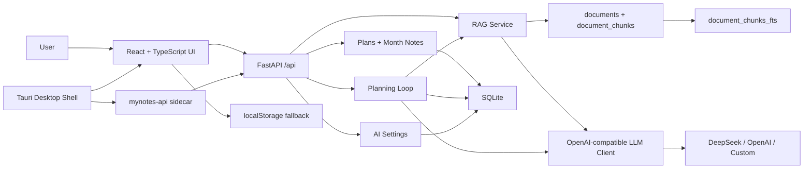

<p align="center">
  <br>
  <strong>MyNotes AI</strong>
  <br>
  <span>AI learning planner, daily review loop, local RAG, and Windows desktop packaging.</span>
  <br><br>
  
  
  
  
</p>


## 中文介绍

**MyNotes AI** 是一个面向学习、求职和长期目标管理的 AI 规划系统。它把目标输入、资料沉淀、AI 拆解、日程执行、每日复盘、重排预览和资料问答连接成一个完整闭环，而不是只停留在简单日历或聊天框。

当前版本已经升级为作品集强展示方向：前端使用 React + TypeScript + Vite，后端使用 FastAPI，数据层使用 SQLite，并基于 SQLite FTS5/BM25 构建本地 RAG。AI 调用采用 DeepSeek-first 的 OpenAI-compatible client，默认保持 mock fallback；没有 API key 时也可以完整演示，真实调用需要用户显式开启。

## English

**MyNotes AI** is an AI planning and review system for learning, job search, and long-term goal management. It connects goal planning, knowledge grounding, calendar execution, daily review, replan preview, material Q&A, and planner evaluation into one practical workflow.

The project uses React + TypeScript + Vite on the frontend, FastAPI on the backend, and SQLite as the local data layer. It supports DeepSeek/OpenAI-compatible LLM calls with deterministic mock fallback, SQLite FTS5/BM25 retrieval, source citations, TXT/MD material upload, and a Tauri Windows desktop shell with a packaged FastAPI sidecar.

## Current Stage

| Stage | Status | Result |
| --- | --- | --- |
| Phase 0 | Done | Project audit and staged rebuild plan |
| Phase 1 | Done | React + TypeScript + Vite frontend in `apps/web` |
| Phase 2 | Done | FastAPI routers, SQLite schema, plans API, month-notes API, tests |
| Phase 3 | Done | AI settings, DeepSeek-first client, model test endpoint |
| Phase 4 | Done | Persistent goal planning, daily reviews, replan preview, apply-to-calendar flow |
| Phase 5 | Done | SQLite FTS5/BM25 RAG, document library, source citations |
| Phase 6 | Done | TXT/MD upload RAG and six-dimension planner evaluation |
| Phase 7 | Done | Tauri desktop shell, FastAPI sidecar strategy, build scripts |
| Phase 8 | Done | Windows MSI pipeline, sidecar preflight, release asset generation |
| Phase 9 | Next | Desktop polish, auto-update, signing, and portfolio presentation |

## Features

| Module | What it does |
| --- | --- |
| Calendar planning | Manage daily tasks with time, completion status, review notes, and AI/manual source |
| Goal planning | Turn a long-term goal into phases and today tasks |
| Daily review | Generate a persisted daily review from completed and unfinished plans |
| Replan preview | AI suggestions do not mutate data until the user clicks apply |
| Knowledge base | Save pasted JDs, notes, interview materials, or project context |
| TXT/MD upload | Upload `.txt` and `.md` files into the same RAG knowledge base |
| FTS5/BM25 RAG | Chunk local materials, search with SQLite FTS5, rank with BM25 |
| Source citations | Return document title, chunk, score, and chunk index for grounded answers |
| Planner evaluation | Score planning quality across six fixed dimensions |
| Model settings | Configure provider, base URL, model, key presence, temperature, and timeout safely |
| Desktop package | Bundle Tauri window, built web assets, and FastAPI sidecar into a Windows MSI |

## Tech Stack

| Layer | Stack |
| --- | --- |
| Frontend | React 18, TypeScript, Vite, lucide-react |
| Backend | Python, FastAPI, Pydantic, httpx |
| Database | SQLite, FTS5 virtual table, BM25 ranking |
| AI workflow | Planner Agent, daily review loop, RAG, memory, evaluation, mock fallback |
| LLM client | DeepSeek-first OpenAI-compatible client |
| Desktop | Tauri v2, PyInstaller FastAPI sidecar, Windows MSI |
| Quality | Pytest, Vitest, ESLint, TypeScript build, GitHub Actions |

## Architecture



More details:

- [Architecture](docs/architecture.md)
- [Desktop Packaging Notes](docs/desktop.md)

## Run Locally

Backend:

```bash
python -m venv .venv
.\.venv\Scripts\activate
pip install -r requirements.txt
uvicorn backend.app.main:app --reload
```

Frontend:

```bash
cd apps/web
npm install
npm run dev
```

Open:

```text
http://127.0.0.1:5173
```

## Desktop MSI

The expected release assets for version `1.1.4` are:

```text
release/MyNotes-AI-v1.1.4-windows-x64.msi
release/MyNotes-AI-v1.1.4-windows-x64.sha256
```

Installed layout:

```text
H:\mynotes\
  mynotes.exe
  resources\
    index.html
    assets\
    binaries\
      mynotes-api.exe
```

Normal users only need the MSI. They should not run `mynotes-api.exe` manually, install Node/Python/Rust, or set `MYNOTES_SKIP_SIDECAR`. The Tauri app starts the FastAPI sidecar automatically, checks `/api/health`, and reuses an existing MyNotes API process when one is already running.

Build locally:

```powershell
.\scripts\check-packaging-toolchain.ps1
.\scripts\build-release.ps1 -Version 1.1.4
```

If desktop startup fails, check:

```text
%APPDATA%\MyNotes AI\logs\desktop.log
```

## AI Configuration

Recommended DeepSeek settings:

```text
Provider: DeepSeek
Base URL: https://api.deepseek.com
Chat endpoint: /chat/completions
Default model: deepseek-v4-flash
Optional model: deepseek-v4-pro
```

The final DeepSeek request URL is:

```text
https://api.deepseek.com/chat/completions
```

It should not become:

```text
https://api.deepseek.com/v1/chat/completions
```

API keys are accepted by `PUT /api/ai/settings`, but `GET /api/ai/settings` only returns `hasApiKey`; it never returns the full key. Logs only record provider, model, sanitized base URL, key presence, and a masked key when needed.

Real LLM calls are disabled by default. Manual real DeepSeek testing requires:

```powershell
$env:DEEPSEEK_API_KEY="your-key"
$env:USE_REAL_LLM="1"
.\scripts\test-deepseek-real.ps1
```

## RAG Workflow

1. Paste a JD, course note, interview note, or project brief into the knowledge base, or upload a `.txt/.md` file.
2. `POST /api/rag/documents` and `POST /api/rag/documents/upload` save metadata into `documents` and chunks into `document_chunks`.
3. Each chunk is inserted into `document_chunks_fts`.
4. `POST /api/rag/query` searches with FTS5, ranks with `bm25()`, and returns `answer`, `sources`, and `keywords`.
5. `POST /api/planning/goal-plan` can retrieve matching sources and show them as planning references.

## Verify

Backend:

```bash
python -m compileall backend
.\.venv\Scripts\python.exe -m pytest backend/tests
```

Frontend:

```bash
cd apps/web
npm.cmd install
npm.cmd run build
```

Desktop:

```powershell
cd apps\desktop
npm.cmd install
cargo fmt
npm.cmd run build
```

Full release package:

```powershell
.\scripts\build-release.ps1 -Version 1.1.4
```

Installed MSI smoke test:

```powershell
.\scripts\smoke-test-installed.ps1
```

## API

| Endpoint | Purpose |
| --- | --- |
| `GET /api/health` | Health check with `status`, `app`, `pid`, and `version` |
| `GET /api/plans?date=YYYY-MM-DD` | List plans for one day |
| `POST /api/plans` | Create a plan |
| `PATCH /api/plans/{id}` | Update a plan |
| `DELETE /api/plans/{id}` | Delete a plan |
| `GET /api/month-notes?year=YYYY&month=M` | Read a monthly note |
| `PUT /api/month-notes` | Save a monthly note |
| `GET /api/ai/settings` | Read public model settings without exposing the key |
| `PUT /api/ai/settings` | Save provider, model, base URL, key, temperature, and timeout |
| `POST /api/ai/test` | Test mock mode or the configured model when real calls are enabled |
| `POST /api/planning/goal-plan` | Generate and persist a goal plan with optional RAG sources |
| `POST /api/planning/daily-review` | Generate and persist a daily review plus replan preview |
| `GET /api/planning/daily-review?date=YYYY-MM-DD` | Read a saved daily review |
| `POST /api/planning/replan/apply` | Apply preview tasks to the calendar |
| `POST /api/rag/documents` | Save pasted material and build FTS chunks |
| `POST /api/rag/documents/upload` | Upload a TXT/MD file and build FTS chunks |
| `GET /api/rag/documents` | List knowledge-base documents |
| `DELETE /api/rag/documents/{id}` | Delete a document and its chunks |
| `POST /api/rag/ingest` | Legacy ingest endpoint, still supported |
| `POST /api/rag/query` | Query the local knowledge base and return citations |
| `POST /api/agent/plan` | Generate staged planning output |
| `POST /api/agent/review` | Generate daily review suggestions |
| `POST /api/memory/preferences` | Save preferences |
| `POST /api/eval/planner` | Evaluate planner quality across six dimensions |

## Resume Pitch

独立开发 **MyNotes AI** 学习规划系统，基于 React + TypeScript + Vite 构建前端，使用 FastAPI + SQLite 实现本地数据层，支持日程管理、目标拆解、日报复盘、重排预览、资料库问答、TXT/MD 文件上传、偏好记忆、模型配置和规划质量评测。实现 DeepSeek-first 的 OpenAI-compatible LLM client，并保留 mock fallback，保证无 API key 时也可完整演示；基于 SQLite FTS5/BM25 构建本地 RAG 检索能力，对资料进行切片、索引、Top-K 召回和引用来源展示；补齐 Tauri 桌面壳、FastAPI sidecar、Windows MSI 构建脚本和启动健康检查，形成可展示的 AI 全栈作品。

## License

MIT
