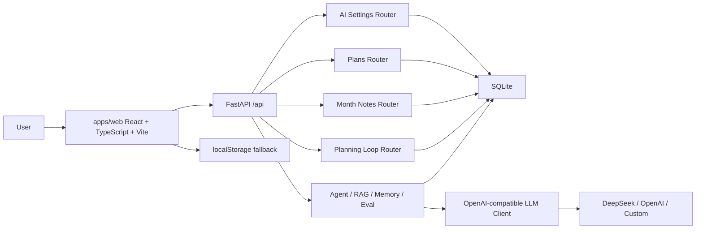

<p align="center">
  <br>
  <strong>MyNotes AI</strong>
  <br>
  <span>AI learning planner, daily review, and personal knowledge assistant.</span>
  <br><br>
  
  
  
  
</p>


## 中文介绍

**MyNotes AI** 是一个面向学习、求职和长期目标管理的 AI 规划系统。它从本地日程工具升级为 React + TypeScript 前端、FastAPI 后端和 SQLite 数据层，目标是成为可以展示给 AI 应用开发 / AI 全栈实习岗位的作品集项目。

当前版本已经支持日历计划、每日任务、完成记录、月备注、AI 目标拆解、日报复盘、重排预览、资料问答、偏好记忆、模型设置、DeepSeek/OpenAI-compatible 调用、Agent 工具定义和规划质量评估。没有 API key 时，系统会自动使用 mock fallback，保证演示流程不断。

## English

**MyNotes AI** is an AI planning and review system for learning, job search, and long-term goal management. It combines a React + TypeScript frontend, FastAPI backend, SQLite storage, and an OpenAI-compatible LLM client to demonstrate practical AI application engineering.

The project currently includes calendar planning, daily tasks, completion records, monthly notes, AI goal decomposition, persisted daily reviews, replan previews, material Q&A, preference memory, model settings, DeepSeek/OpenAI-compatible calls, Agent tools, and planner evaluation.

## Current Stage

| Stage | Status | Result |
| --- | --- | --- |
| Phase 0 | Done | Project audit in `docs/audit.md` |
| Phase 1 | Done | Frontend migrated to `apps/web` with React + TypeScript + Vite |
| Phase 2 | Done | FastAPI routers, SQLite schema, plans API, month-notes API, tests |
| Phase 3 | Done | AI settings, DeepSeek-first OpenAI-compatible client, model test endpoint, LLM fallback |
| Phase 4 | Done | Persistent goal planning, daily reviews, replan preview, and apply-to-calendar flow |
| Phase 5 | Next | SQLite FTS5/BM25 RAG with source citations |

## Features

| Module | What it does |
| --- | --- |
| Calendar planning | Manage daily tasks with time, status, completion notes, and monthly notes |
| SQLite data layer | Store plans, notes, AI settings, documents, chunks, preferences, and run logs |
| Model settings | Configure provider, base URL, model, API key, temperature, and timeout |
| LLM client | Calls DeepSeek/OpenAI-compatible `/v1/chat/completions` when a key exists |
| Mock fallback | Keeps all AI workflows demoable without a paid API key |
| AI planning | Generate staged plans and daily tasks from a long-term goal |
| Daily review | Persist daily review records and suggest next actions |
| Replan preview | Preview tomorrow's adjusted tasks and apply them only after user confirmation |
| Material Q&A | Query pasted learning materials or job descriptions with retrieval-style scoring |
| Preference memory | Save personal learning rhythm and planning preferences |
| Evaluation | Score planning quality with simple test cases and criteria |

## Tech Stack

| Layer | Stack |
| --- | --- |
| Frontend | React 18, TypeScript, Vite, lucide-react |
| Backend | Python, FastAPI, Pydantic, httpx |
| Database | SQLite |
| AI workflow | DeepSeek-first LLM client, Planner Agent, RAG prototype, Memory, Eval |
| Quality | ESLint, Vitest, Pytest, GitHub Actions |

## Architecture



More details: [docs/architecture.md](docs/architecture.md)

## Run Locally

Start the backend:

```bash
python -m venv .venv
.\.venv\Scripts\activate
pip install -r requirements.txt
uvicorn backend.app.main:app --reload
```

Start the frontend:

```bash
cd apps/web
npm install
npm run dev
```

Open:

```text
http://127.0.0.1:5173/MyNotes.html
```

## Configure AI

You can configure the model inside the AI workspace:

```text
Provider: DeepSeek
Base URL: https://api.deepseek.com
Model: deepseek-chat
API Key: your key
```

API keys are accepted by the backend but are never returned by `GET /api/ai/settings`. Without a key, the backend returns stable mock results.

Environment variables are also supported:

```bash
AI_PROVIDER=deepseek
AI_API_KEY=
AI_API_BASE=https://api.deepseek.com
AI_MODEL=deepseek-chat
DATABASE_URL=sqlite:///./data/mynotes.db
```

## Verify

Backend:

```bash
python -m compileall backend
pytest backend/tests
```

Frontend:

```bash
cd apps/web
npm run build
npm run test
npm run lint
```

## API

| Endpoint | Purpose |
| --- | --- |
| `GET /api/health` | Health check |
| `GET /api/plans?date=YYYY-MM-DD` | List plans for one day |
| `POST /api/plans` | Create a plan |
| `PATCH /api/plans/{id}` | Update a plan |
| `DELETE /api/plans/{id}` | Delete a plan |
| `GET /api/month-notes?year=YYYY&month=M` | Read a monthly note |
| `PUT /api/month-notes` | Save a monthly note |
| `GET /api/ai/settings` | Read public model settings without exposing the key |
| `PUT /api/ai/settings` | Save provider, model, base URL, key, temperature, and timeout |
| `POST /api/ai/test` | Test the configured model or mock fallback |
| `POST /api/planning/goal-plan` | Generate and persist a goal plan |
| `POST /api/planning/daily-review` | Generate and persist a daily review plus replan preview |
| `GET /api/planning/daily-review?date=YYYY-MM-DD` | Read a saved daily review |
| `POST /api/planning/replan/apply` | Apply preview tasks to the calendar |
| `POST /api/agent/plan` | Generate staged planning output |
| `POST /api/agent/review` | Generate daily review suggestions |
| `POST /api/rag/query` | Query materials |
| `POST /api/memory/preferences` | Save preferences |
| `POST /api/eval/planner` | Evaluate planner quality |

## Resume Pitch

独立开发 MyNotes AI 学习规划系统，基于 React + TypeScript + Vite 构建前端，使用 FastAPI + SQLite 实现本地数据层，支持日程管理、目标拆解、日报复盘、重排预览、资料问答、偏好记忆、模型配置和规划质量评估；实现 DeepSeek-first 的 OpenAI-compatible LLM client，并保留 mock fallback，保证无 API key 时也可完整演示；通过 ESLint、Vitest、Pytest 和 GitHub Actions 建立基础工程质量闭环。

## License

MIT
