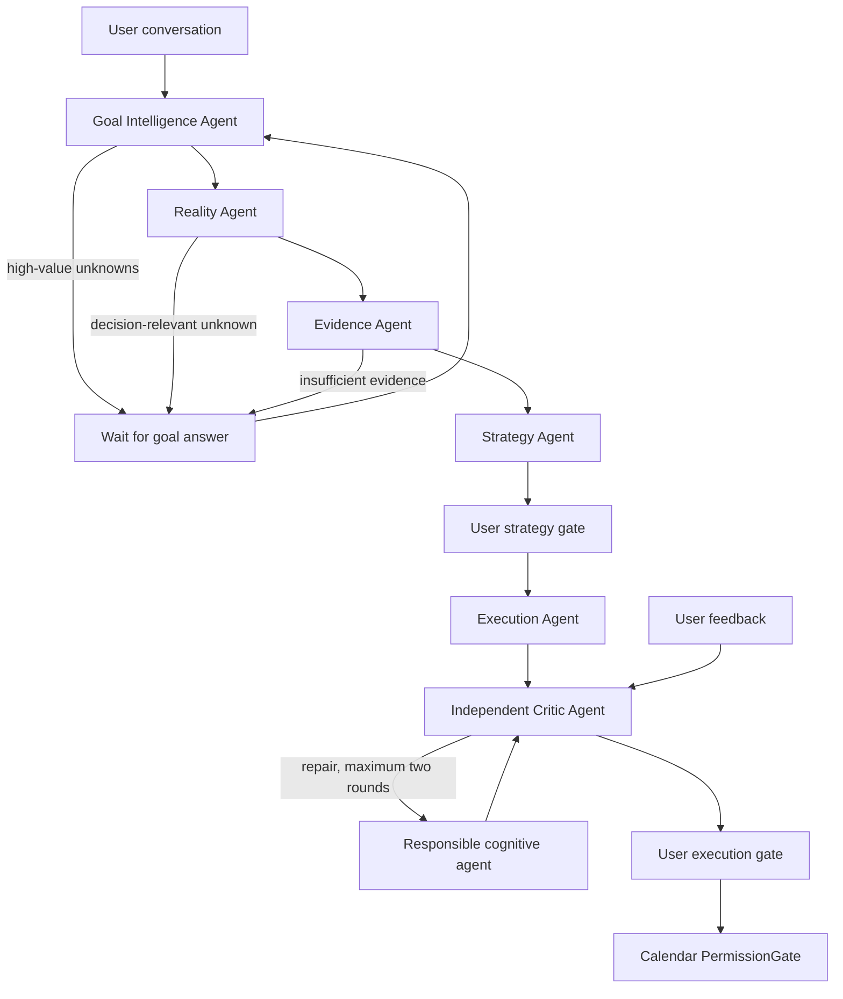

# Planix

[点击此处下载完整演示视频](assets/readme/planix-demo.mp4)


**Planix is a user-centered Cognitive Planning OS with an AI-first planning workspace, durable user memory, independent critique, safe Calendar execution, Tauri, and FastAPI sidecar packaging.**

Planix 是一个面向真实目标的桌面 AI 规划工作台。P Mode 先理解用户真正想改变什么，再评估现实条件、整理证据、与用户共创策略、设计执行方案，并由独立 Critic 审查后才允许进入 Calendar。长期事实、习惯、偏好、约束和失败模式会以带证据与置信度的 User Model Memory 保存，而不是被固化为一次对话中的模板答案。

它不是普通的 prompt demo。Planix 的重点是让模型判断、结构化契约、用户确认、独立审查和正式写入形成可验证闭环。模型不可用或结构化输出不合格时，P Mode 明确进入 `MODEL_UNAVAILABLE`，只保留已经理解的事实，不会用本地模板伪装成 AI 计划。

## Phase 7 / Cognitive Planning OS

P Mode 默认使用 `backend/app/cognitive_planning` 下的 Cognitive OS 内核。LangGraph 只负责状态流转，六个独立角色负责真正判断：

```text
Goal Intelligence
  -> Reality
  -> Evidence
  -> Strategy
  -> user strategy approval
  -> Execution
  -> Critic
  -> bounded repair (maximum two rounds)
  -> user execution approval
  -> Calendar preview / PermissionGate
```

- **Goal Intelligence** 理解目标、已知事实和真正影响决策的未知项，不使用领域问卷或固定问题库。
- **Reality** 独立检查时间、预算、环境、安全、前置条件和可行性。
- **Evidence** 综合 Memory、Calendar、本地资料和明确获批的外部来源；静态资源目录不再决定计划。
- **Strategy** 给出可比较、可解释的方向，等待用户确认后才进入执行设计。
- **Execution** 把已确认策略转换为有依赖、资源用法、完成证据和降级动作的任务。
- **Critic** 独立否决领域错误、资源虚构、工作量失真或无法执行的方案，并把修复请求交回责任 Agent。

`PLANIX_COGNITIVE_MODE=true` 启用新内核。旧 Planning Session 字段、历史事件和手动 Workbench Runtime 继续兼容，但它们不再是默认 P Mode 规划来源。P Mode 只显示用户能理解的目标、现实评估、证据、策略、执行与审查结果；Agent 决策表和内部消息仍保存在后端供审计，不作为主界面日志展示。

## Demo / 项目演示

Planix 的核心演示路径是：在 P Mode 输入一个真实目标，例如“我想准备 AI 应用实习”或“9 月去新疆 14 天”，系统先展示对目标的理解与最值得确认的问题，再经过现实评估和证据综合给出策略。用户确认策略后才生成执行蓝图，独立 Critic 通过且用户再次确认后，才允许进入 Calendar 预览与 PermissionGate。手动 Workbench 仍可演示旧 Runtime 执行链，但它不是默认规划入口。

## Demo Reliability / 稳定演示验收

Planix does not simply trust LLM output. Legacy Goals/Dashboard flows still validate plan horizon, task density, date coverage, weak task titles, source relevance, and fallback usage before showing proposals. Cognitive OS uses its own Goal/Reality/Evidence contracts, independent Critic, and Calendar gates and never uses local content fallback.

当前 demo 重点锁定三条高风险路径：

1. 三个月 Python 学习规划必须识别为 90 天计划，并通过 repair 或 local fallback 保证 24+ tasks、10+ covered weeks。
2. Calendar 写入必须保留 generated task 的 `description`、`estimatedMinutes`、`priority` 和 `sourceKey`，不会覆盖用户手动填写的 completion / result / done。
3. Calendar 任务细化会通过 `command-draft:*` sourceKey 恢复原始 draft 上下文，避免把滑雪站姿/平衡任务错细化成瑜伽等无关领域。

前端会在 Dashboard proposal、P Mode draft、Goals preview 中展示简洁质量指标：计划质量、周期、任务数、覆盖周数、日期跨度和来源类型。后端 `/api/health` 返回 `version = 3.11-demo-reliability` 以及 `planQualityGate`、`contextAwareRefinement`、`calendarDraftContextRecovery`、`demoMetrics` feature flags；如果页面仍生成稀疏计划，先检查当前 8000 端口是否加载了这个版本。

## Planix 是什么

Planix 是一个桌面端 AI planning workspace，目标是帮助用户把模糊目标拆成可以执行、可以追踪、可以写入日历的计划。

适合场景：

- 学习计划：AI Agent、编程、英语、考试、实习准备。
- 求职计划：简历优化、项目复盘、面试准备、作品集打磨。
- 长期目标管理：阶段目标拆解、任务细化、日历排期。
- 本地资料驱动规划：结合用户保存的笔记、资料和历史计划生成更贴合上下文的建议。

## Planix 工作流程

### P Mode 认知规划流程

用户输入目标后，P Mode 通过 FastAPI Planning Session 进入 Cognitive OS。每个认知阶段都使用模型和严格契约生成独立 artifact；规则只负责校验和 Gate，不生成规划内容。用户可以补充信息、比较并确认策略、审查执行蓝图，最后明确触发日历写入。

```text
用户目标
  → P Mode Planning Session
  → Goal Intelligence / Reality
  → Evidence / Strategy
  → 用户确认策略
  → Execution / Critic
  → 用户确认执行方案
  → Calendar preview / PermissionGate
```

### Legacy Workbench / Dashboard Runtime

Dashboard 或用户手动开启 Workbench 时，旧 RuntimeOrchestrator 仍可按固定链路组织工具调用并通过 NDJSON streaming 返回 Trace。该流程用于兼容和调试，不会替代 P Mode Cognitive OS，也不能在模型失败时为新内核生成本地模板计划。

```text
用户运行智能体
  → RuntimeOrchestrator
  → get_memory
  → get_today_plans
  → search_materials
  → enrich_with_model_knowledge
  → propose_tasks
  → NDJSON streaming
  → Agent Flow Trace / P Mode 执行链
```

### P Mode 写入日历流程

P Mode 不会自动写入 Calendar。Cognitive OS 必须先获得策略确认、执行确认和可写的 Critic 结论；用户随后明确说“写入日历”，Planix 才把当前 execution blueprint 投影成 Calendar WriteIntent，并继续经过 action preview、PermissionGate 和 ApprovalCard。旧 Workbench hidden draft 仍走原有兼容写入链路。

```text
用户说“写进日历”
  → 校验当前 Planning Session 与 Critic 结论
  → 投影 execution blueprint
  → 生成 Calendar WriteIntent
  → PermissionGate 判断
  → ApprovalCard 或自动执行
  → plans API 写入 Calendar
  → P 页面显示写入结果
```

### 任务细化流程

用户说“细化任务”“细化计划”或“细化全部任务”时，Planix 会读取当前 draft 或 Calendar plan，调用 planning refine service 生成 refinedTask。Phase 3.10 会把当前任务在完整计划中的位置、阶段、前后任务、时间预算和资料摘要裁剪成 compact context，再生成可照着执行的时间块、官方学习资源、验收标准和计划匹配检查。Calendar 中来自 P Mode draft 的任务会通过 `command-draft:*` sourceKey 回查原始计划上下文，避免只看泛化任务标题导致跑题。细化结果会写回 draft 或 plan 的 refined task 字段，并以内联卡片展示，不会污染用户填写的 completion / result。

```text
用户请求细化
  → 当前 draft 或 Calendar plan
  → 裁剪完整计划上下文
  → planning refine service
  → 生成 context-aware refinedTask
  → 写回 refined task 字段
  → 前端 inline card 展示
```

### 桌面端启动流程

桌面版启动时，Tauri window 先加载打包后的前端资源，然后启动 FastAPI sidecar。FastAPI 连接本地 SQLite，前端再通过 API / IPC 调用后端能力。

```text
Tauri window 启动
  → 加载前端资源
  → 启动 FastAPI sidecar
  → FastAPI 连接 SQLite
  → 前端通过 API / IPC 调用后端
```

## 核心亮点

- **AI-first 认知规划**：模型分别负责目标理解、现实评估、证据、策略、执行和批判，结构化契约让每一步可验证。
- **证据与 User Model Memory**：规划使用本地资料、Calendar 现实和带证据的长期用户模型，并明确展示证据缺口。
- **独立 Critic 与有限修复**：Critic 可否决不可执行方案并发出定向修复，循环最多两次。
- **P Mode 共创工作流**：用户在策略和执行两个关键 Gate 做决定，而不是只在最后点击确认。
- **安全 Calendar 写入**：Runtime 不自动写入正式数据；计划写入 Calendar 前需要预览、权限判断或用户确认。
- **桌面端工程闭环**：使用 Tauri 桌面壳 + FastAPI sidecar + SQLite 本地数据，让项目从 Web demo 走向可安装桌面应用。

## 为什么不只是 Prompt Demo

很多 AI 应用 demo 只是把用户输入拼成 prompt，然后把模型返回文本显示出来。Planix 的重点不是“调用一次大模型”，而是把 AI 输出接入真实产品流程。

Planix 做了几件更接近真实 AI 应用工程的事情：

1. **结构化输出约束**
   模型输出会被约束为 `structuredPlan`，后端会校验、补全，并从结构化数据派生展示内容和日历任务。

2. **RAG 上下文 grounding**
   系统会先从本地资料库检索相关内容，再生成规划结果，减少纯模型幻觉。

3. **Runtime 可观测性**
   Agent 执行过程通过 NDJSON 事件流输出，前端渲染为 Agent Flow Trace，而不是只显示最终答案。

4. **用户确认后的动作执行**
   计划写入 Calendar 前需要用户预览和确认，避免 AI 自动修改正式数据。

5. **桌面端交付能力**
   项目不仅有前端和后端，还包含 Tauri 桌面壳、PyInstaller / FastAPI sidecar、本地 SQLite 数据和 Windows 安装包展示。

## 系统架构

Planix 采用本地优先的桌面 AI 应用架构：

```text
React + TypeScript 前端界面
        ↓
Tauri Desktop Shell
        ↓
FastAPI Backend Sidecar
        ↓
SQLite / FTS5 / Local Files
        ↓
RAG + Planning Service + Agent Runtime
        ↓
NDJSON Stream → Agent Flow Trace UI
```

核心分层：

- **Frontend Shell**：负责 Dashboard、Calendar、Notes、Goals、Materials、Settings、P Mode 和 Inspector。
- **Cognitive Planning OS**：负责模型驱动的目标、现实、证据、策略、执行、Critic 和 User Model Memory；规则只做校验与 Gate。
- **RAG Layer**：基于 SQLite / FTS5 检索用户本地资料。
- **Agent Runtime**：保留 Dashboard / Workbench 的 memory lookup、tool routing、task proposal 和 runtime event streaming 兼容能力。
- **Persistence Layer**：使用 SQLite 保存计划、笔记、资料、设置、Runtime 记录和 Command thread。
- **Desktop Packaging**：使用 Tauri 桌面壳和 FastAPI sidecar 打包为 Windows 桌面应用。

## 功能模块

### 目标规划

- 输入一个宽泛目标。
- 生成阶段、里程碑、任务、预计时间、优先级和复盘问题。
- 输出 `structuredPlan`。
- 自动识别计划周期，按 horizon-aware density policy 校验任务密度、周覆盖和日期范围。
- `GoalPlanOut` 返回 `planHorizon`、`qualityReport`、`qualityStatus`、`sourceType` 和 `localRelevance`，供 Goals、Dashboard Runtime proposal 和 P Mode draft 共用。
- 支持 fallback 和错误诊断。
- 稀疏或低质量模型输出最多 repair 1 次；仍失败时使用本地模板兜底，90-day fallback 至少生成 24 个任务并覆盖 10+ 周。
- 用户确认后可将任务写入 Calendar。

### 本地资料库 / RAG

- 支持保存和上传 TXT / MD 资料。
- 使用 SQLite FTS5 / BM25-style search 检索本地内容。
- 规划和 Runtime 可以引用相关资料。
- 前端展示参考资料来源。

### Agent Runtime

- 将一次用户目标转化为可观察的执行流。
- 支持 NDJSON streaming。
- 前端展示 Agent Flow Trace。
- Runtime 工具以只读检索和预览提案为主。
- `propose_tasks` 会携带计划质量、周期、来源准确性和本地相关性字段，但保持 `writeMode="preview"`。
- 当本地资料不足时，Runtime 最终输出会标注通用建议 caveat，避免把模型知识误写成本地资料事实。
- 默认不自动写入正式数据。

### P Mode / Command Agent

P Mode 默认停留在 `auto` 状态。普通查询、记忆和 Calendar 命令仍通过 `CommandDecision` 路由；规划请求进入 Cognitive Planning Session。启用 `PLANIX_COGNITIVE_MODE=true` 后，P Mode 依次形成目标理解、现实评估、证据包、策略方案、执行蓝图和独立审查。手动 `workbench` 继续保留旧 Runtime / hidden draft，仅用于兼容和调试。

Phase 4.8 keeps the existing `#/command` surface and streams command cards through `/api/command/chat` and `/api/command/approve`. Phase 4.8.2 adds a unified Memory Store and Memory Agent: Calendar plans represent formal executable plans, while memories represent long-term context that Planix can reference. P Mode now separates `query_plan` from `query_memory`; viewing plans searches Calendar only, while memory search reads the `memories` table and groups personal records, knowledge materials, planning archives, preference constraints, and review feedback.

Calendar and memory writes stay permission-gated. Calendar requests such as moving a task, changing time or duration, renaming a plan, or deleting a plan create `command_actions` with `target="calendar"` and emit `plan_patch_preview`; memory-save requests create `command_actions` with `target="memory"` and emit `memory_write_preview` before writing to `memories` after approval. Legacy `note_*` events and `target="notes"` actions remain replay-compatible and are internally treated as note memories. Calendar updates only touch title/date/time/estimated duration and preserve completion, done state, source, and sourceKey.

Phase 4.8.1 polishes the P Mode conversation UX. The empty state now shows concrete things users can say, QuickActionBar uses fixed natural-language shortcuts, `CommandDecision` cards explain intent in user-facing wording, plan/note result cards expose row actions that send ordinary chat commands back through `/api/command/chat`, note recording previews show the target month clearly, and model usage appears as lightweight footer text.

Phase 4.9A adds the internal Planix AI SDK / ModelProvider layer. Backend model calls now flow through `ModelRouter` and provider adapters for `mock`, `deepseek`, `kimi`, `zhipu_glm`, `openai`, and `custom`, while `LlmClient` remains the compatibility facade for existing planning, Runtime, RAG, P Mode, and Settings code. This phase standardizes provider/model identity, usage parsing, latency, error types, URL normalization, JSON response-format handling, token caps, and local fallback semantics without adding public REST routes or task-level multi-model routing.

Phase 4.9A.1 lets Settings store API Keys per provider. The active provider remains singular, but DeepSeek, Kimi, Zhipu GLM, OpenAI, and Custom can each keep their own saved key and model/base URL config. Settings shows the current active provider plus saved-key chips, and deleting a chip clears only that provider key.

Phase 4.9B.1 verifies and polishes task-level model routing. Settings can route intent decisions, plan generation, task refinement, calendar patch extraction, memory query/write, model knowledge, and chat to different primary/fallback providers. Runtime and P Mode model-usage cards show the final provider/model, token usage, latency, fallbackUsed, and safe route attempts such as missing-key skips, provider errors, fallback success, or local fallback.

### Phase 7 Cognitive Planning Kernel

Phase 7 makes the AI-first kernel the default P Mode planning path. LangGraph coordinates stage transitions, while separate model calls own the cognitive work:

```text
Goal Intelligence
  -> Reality Assessment
  -> Evidence Synthesis
  -> Strategy Proposal
  -> user strategy approval
  -> Execution Narrative + Blueprint
  -> Independent Critic
  -> bounded repair (at most 2 rounds)
  -> user execution approval
  -> Calendar preview / PermissionGate
```



The kernel persists typed artifacts, safe decisions, evidence gaps, critique reports, repair history, conversation context, and evidence-backed User Model Memory. Deterministic guards validate IDs, dependencies, dates, deliverables, evidence, resources, fallback steps, and Calendar eligibility; they never invent planning content. Phase 7 does not use domain templates, fixed question banks, or a static resource catalog to make planning decisions.

Formal planning is model-backed only. If the configured model is unavailable, returns invalid JSON, or cannot satisfy the typed contract, Planix enters the exact `MODEL_UNAVAILABLE` state, preserves understood facts, and asks the user to retry or fix model settings. It does not silently present a local template as an AI-created formal plan. Calendar remains blocked until the strategy and execution gates are explicitly approved and the independent critic marks the blueprint writable.

The P Mode workspace is replayable and user-facing: Goal Understanding, Reality Assessment, Evidence, Strategy, Execution, Critic Review, and Learning Update. Raw Agent decisions, messages, confidence plumbing, and runtime status are retained for audit but hidden from the primary planning workspace. Existing Planning Session cards and old Runtime/draft history remain replay-compatible.

`backend/app/cognitive_planning` is the canonical Phase 7 implementation. `deep_planning.py` and the Phase 6 service tree remain compatibility facades; the frozen template implementation lives in `legacy_deep_planning.py` as `legacy-template-v1`. Cognitive OS never falls back to it.

The cognitive `planning_*` model routes always disable local content fallback, even if an older saved routing row enabled it. Settings shows this safety rule explicitly. Agent decisions and both user approval gates persist the input/output artifact IDs they acted on, so replay can audit the exact strategy, execution blueprint, and critique versions behind a Calendar write.

Stage token budgets can be tuned independently with `PLANIX_GOAL_MODEL_MAX_TOKENS`, `PLANIX_REALITY_MAX_TOKENS`, `PLANIX_EVIDENCE_MAX_TOKENS`, `PLANIX_STRATEGY_MAX_TOKENS`, `PLANIX_EXECUTION_MAX_TOKENS`, `PLANIX_CRITIQUE_MAX_TOKENS`, and `PLANIX_LEARNING_MAX_TOKENS`.

See [`docs/planning-template-inventory.md`](docs/planning-template-inventory.md) for the frozen legacy surface, [`docs/cognitive-planning-acceptance.md`](docs/cognitive-planning-acceptance.md) for Phase 6 compatibility evidence, and [`docs/cognitive-os-acceptance.md`](docs/cognitive-os-acceptance.md) for the Phase 7 requirement map.

- 提供命令式 AI 对话入口。
- 支持 Auto Agent Mode、强制 Chat 模式、强制 Workbench 模式。
- 支持计划草稿生成、展开、修改、细化和上下文追问。
- 支持通过权限机制确认后写入 Calendar。
- 支持通过 QuickActionBar 发送自然语言快捷指令，不绕过 LLM decision。
- 执行链以内联卡片展示，避免把页面变成复杂工作台。

### Calendar 执行闭环

- 日历计划可以来自用户手动输入，也可以来自确认后的 AI 计划。
- AI 写入不覆盖用户 completion / result / done。
- AI 写入会保留原任务 description、estimatedMinutes、priority 和 sourceKey；已有 AI 任务只在 result 为空时补齐描述。
- 任务细化内容作为计划执行说明保存，不污染完成情况。
- 细化任务会按不超过 30 分钟的 time blocks 展示，并优先给出官方/权威学习资源。

### 桌面端

- Tauri 桌面壳。
- FastAPI backend sidecar。
- SQLite 本地数据。
- Windows 安装包展示。
- MSI 保留为备用 / 企业安装格式。

## 技术栈

- **Frontend**：React, TypeScript, Vite
- **Desktop**：Tauri
- **Backend**：Python, FastAPI
- **Storage**：SQLite, local files
- **Retrieval**：SQLite FTS5 / BM25-style search
- **Runtime**：NDJSON streaming, Agent Flow Trace
- **AI Provider**：Planix internal ModelProvider layer for mock, DeepSeek, Kimi, Zhipu GLM, OpenAI, and custom OpenAI-compatible APIs
- **Packaging**：PyInstaller sidecar, Tauri Windows installer

## 本地运行

### 后端

```powershell
python -m venv .venv
.\.venv\Scripts\activate
pip install -r requirements.txt
uvicorn backend.app.main:app --reload
```

### 前端

```powershell
cd apps\web
npm install
npm run dev
```

### 桌面端

```powershell
.\scripts\dev-desktop.ps1
cd apps\desktop
npm install
npm run dev
```

## 验证方式

```powershell
python -m compileall backend
.\.venv\Scripts\python.exe -m pytest backend\tests
cd apps\web
npx.cmd tsc -b
npm.cmd run lint
npm.cmd run test
npm.cmd run build
```

Backend health check:

```powershell
curl http://127.0.0.1:8000/api/health
```

Demo readiness check:

```powershell
.\scripts\verify-demo.ps1
```

## Roadmap

### 已完成

- Planning Intelligence + `structuredPlan` 结构化规划。
- Phase 3.9 Plan Quality Gate / Planning Reliability。
- Phase 3.10 Context-aware Task Refinement / 基于完整计划上下文的任务细化。
- Phase 3.11 Demo Reliability & Evaluation Metrics / 稳定演示验收与质量指标。
- Grounded RAG 本地资料检索。
- Agent Runtime + NDJSON streaming。
- Agent Flow Trace 可观测执行轨迹。
- P Mode / Command Agent 命令式规划工作流。
- Phase 4.8 P Mode LLM-first command decision router, Calendar plan query, memory query/write cards, Calendar patch, and model usage events.
- Phase 4.8.1 P Mode conversation UX polish: clearer empty state, fixed quick actions, user-facing decision cards, row action buttons, note record preview, and compact model usage.
- Phase 4.8.2 Unified Memory Store and Memory Agent: `memories` with FTS, grouped memory search, memory write previews, and planning-history archives.
- Phase 4.9A Planix AI SDK / ModelProvider layer with standardized provider, usage, latency, error type, URL normalization, and local fallback semantics.
- Phase 4.9A.1 Settings multi-provider API Key persistence and visible provider-key deletion.
- Phase 4.9B.1 task-level model routing acceptance and observability: canonical `memory_query` / `memory_write`, fallback attempts, and clearer Settings routing hints.
- Phase 5 Human-in-the-loop Planning Sessions, agent artifacts/messages, active-session continuation, approval gates, and LangGraph orchestration facade.
- Phase 6 Cognitive Planning Kernel: typed goal/evidence/strategy/execution/critique/learning artifacts, model-backed cognitive stages, bounded critic repair, deterministic Calendar guards, replayable cognitive cards, and tentative cross-session planning hypotheses.
- Phase 7 Cognitive Planning OS: independent Goal/Reality/Evidence/Strategy/Execution/Critic judgment, evidence-backed User Model Memory, exact `MODEL_UNAVAILABLE`, and a user-facing P Mode planning workspace without template decisions or technical Agent logs.
- Calendar-ready proposal 预览与确认写入。
- Tauri 桌面端原型。
- FastAPI sidecar 打包链路。

### 进行中

- Windows 安装包体验优化。
- Runtime replay / debug view。
- README 作品集化与真实截图补充。
- 更清晰的动作审批 UX。
- P Mode 细化任务体验优化。

### 下一步

- 多计划工作区。
- 更稳定的 Runtime 回放和调试。
- 更多工具集成。
- 更完整的新用户 onboarding 示例数据。

## 面试展示价值

Planix 主要展示以下能力：

- **AI 应用工程**：把模型输出接入真实业务流程，而不是只做 prompt demo。
- **全栈开发**：React 前端、FastAPI 后端、SQLite 存储、桌面端打包。
- **Agent Runtime 设计**：可观察的执行链、工具路由、事件流和安全边界。
- **RAG 系统实践**：本地资料检索、上下文注入、来源展示。
- **产品化能力**：从 Web 应用扩展到可安装桌面应用。
- **安全意识**：API Key 不提交，Runtime 不自动写入正式数据，Calendar 写入需要用户确认。

## 下载 Code 后进入 Planix

如果你想在本地查看和运行 Planix，可以直接下载源码进入项目。

### 方法一：Download ZIP

1. 打开 GitHub 仓库页面。
2. 点击绿色 `Code` 按钮。
3. 选择 `Download ZIP`。
4. 解压后进入项目目录。

### 方法二：git clone

```powershell
git clone https://github.com/ab2956955606-cmyk/Planix.git
cd Planix
```

### 启动后端

```powershell
python -m venv .venv
.\.venv\Scripts\activate
pip install -r requirements.txt
uvicorn backend.app.main:app --reload
```

### 启动前端

打开另一个终端：

```powershell
cd apps\web
npm install
npm run dev
```

然后在浏览器打开 Vite 输出的本地地址，通常是：

```text
http://127.0.0.1:5173
```

### 可选：桌面开发模式

```powershell
.\scripts\dev-desktop.ps1
```
