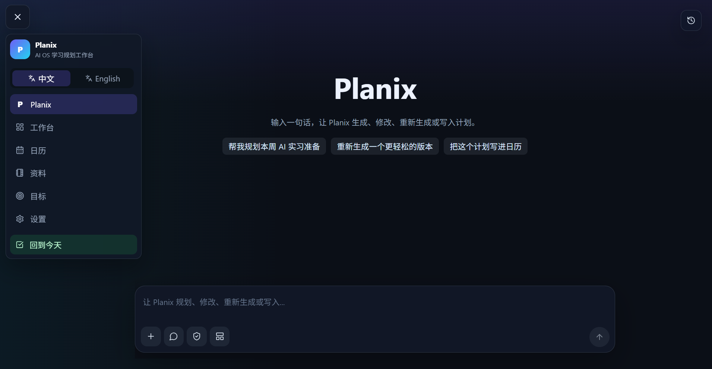

# Planix

[点击此处下载完整演示视频](assets/readme/planix-demo.mp4)



**Planix is an AI planning workspace with AI Agent, RAG, Agent Runtime, `structuredPlan`, P Mode, Tauri, and FastAPI sidecar packaging.**

Planix 是一个面向学习、求职和长期目标管理的桌面 AI 规划工作台。它可以把用户的宽泛目标转化为结构化、可审查、可细化、可写入日历的任务计划，并结合本地资料库检索、Agent Runtime 执行链、P Mode 命令式对话和 Tauri 桌面打包，形成一个完整的 AI 应用工程项目。

它不是普通的 prompt demo。Planix 的重点是把模型输出接入真实应用流程：先通过 RAG 检索本地上下文，再生成 `structuredPlan`，通过 NDJSON streaming 展示 Agent Runtime 过程，最后由用户确认后安全写入 Calendar。

## Demo / 项目演示

Planix 的核心演示路径是：输入一个宽泛目标，例如“帮我规划本周 AI 应用实习准备”，系统会检索本地资料库，生成结构化计划，展示 Agent Runtime 执行链，并允许用户继续细化任务或确认写入日历。页面顶部的视频和截图展示的是 Planix 的真实界面与工作流。

## Planix 是什么

Planix 是一个桌面端 AI planning workspace，目标是帮助用户把模糊目标拆成可以执行、可以追踪、可以写入日历的计划。

适合场景：

- 学习计划：AI Agent、编程、英语、考试、实习准备。
- 求职计划：简历优化、项目复盘、面试准备、作品集打磨。
- 长期目标管理：阶段目标拆解、任务细化、日历排期。
- 本地资料驱动规划：结合用户保存的笔记、资料和历史计划生成更贴合上下文的建议。

## Planix 工作流程

### 普通目标规划流程

用户输入一个目标后，Planix 会先进入前端的 Command / P Mode 或 Goals 页面，再由 FastAPI 的 planning / runtime API 接收请求。后端会检索本地资料库，把相关资料作为上下文交给 LLM 或本地 fallback 规划器，生成 `structuredPlan`。前端拿到结构化计划后展示摘要、完整计划和可执行任务，用户可以继续细化、修改或确认。

```text
用户目标
  → Command / P Mode 或 Goals
  → FastAPI planning / runtime API
  → RAG 检索本地资料
  → LLM / local fallback 生成 structuredPlan
  → 前端展示计划
  → 用户细化 / 修改 / 确认
```

### Runtime 执行流程

当用户运行智能体时，后端 RuntimeOrchestrator 会按固定链路组织工具调用。它先读取偏好和历史记忆，再读取今日计划，然后检索本地资料，必要时补充模型知识，最后生成任务提案。整个过程通过 NDJSON streaming 返回给前端，并渲染为 Agent Flow Trace 或 P Mode 执行链。

```text
用户运行智能体
  → RuntimeOrchestrator
  → get_memory
  → get_today_plans
  → search_materials
  → enrich_with_model_knowledge
  → propose_tasks
  → NDJSON streaming
  → Agent Flow Trace / P Mode 执行链
```

### P Mode 写入日历流程

P Mode 不会让 Runtime 自动写入 Calendar。用户说“写进日历”后，Planix 会读取当前隐藏计划草稿，生成 Calendar WriteIntent，经过 PermissionGate 判断权限。如果需要确认，P 页面显示 ApprovalCard；如果允许自动执行，则通过 plans API 写入 Calendar，并在对话里显示创建、更新和失败结果。

```text
用户说“写进日历”
  → 读取当前 hidden draft
  → 生成 Calendar WriteIntent
  → PermissionGate 判断
  → ApprovalCard 或自动执行
  → plans API 写入 Calendar
  → P 页面显示写入结果
```

### 任务细化流程

用户说“细化任务”“细化计划”或“细化全部任务”时，Planix 会读取当前 draft 或 Calendar plan，调用 planning refine service 生成 refinedTask。细化结果会写回 draft 或 plan 的 refined task 字段，并以内联卡片展示，不会污染用户填写的 completion / result。

```text
用户请求细化
  → 当前 draft 或 Calendar plan
  → planning refine service
  → 生成 refinedTask
  → 写回 refined task 字段
  → 前端 inline card 展示
```

### 桌面端启动流程

桌面版启动时，Tauri window 先加载打包后的前端资源，然后启动 FastAPI sidecar。FastAPI 连接本地 SQLite，前端再通过 API / IPC 调用后端能力。

```text
Tauri window 启动
  → 加载前端资源
  → 启动 FastAPI sidecar
  → FastAPI 连接 SQLite
  → 前端通过 API / IPC 调用后端
```

## 核心亮点

- **结构化目标规划**：模型输出不是一段自由文本，而是可校验、可预览、可写入下游流程的 `structuredPlan`。
- **Grounded RAG 本地资料检索**：规划前先检索用户本地资料库，让计划有上下文依据，而不是纯模型发挥。
- **Agent Runtime 可观测执行链**：通过 NDJSON streaming 展示 memory lookup、material search、task proposal、summary 等关键步骤。
- **P Mode 命令式工作流**：提供类似 Codex / Cursor 的命令式对话入口，用于生成、展开、细化、修改和确认计划草稿。
- **安全 Calendar 写入**：Runtime 不自动写入正式数据；计划写入 Calendar 前需要预览、权限判断或用户确认。
- **桌面端工程闭环**：使用 Tauri 桌面壳 + FastAPI sidecar + SQLite 本地数据，让项目从 Web demo 走向可安装桌面应用。

## 为什么不只是 Prompt Demo

很多 AI 应用 demo 只是把用户输入拼成 prompt，然后把模型返回文本显示出来。Planix 的重点不是“调用一次大模型”，而是把 AI 输出接入真实产品流程。

Planix 做了几件更接近真实 AI 应用工程的事情：

1. **结构化输出约束**
   模型输出会被约束为 `structuredPlan`，后端会校验、补全，并从结构化数据派生展示内容和日历任务。

2. **RAG 上下文 grounding**
   系统会先从本地资料库检索相关内容，再生成规划结果，减少纯模型幻觉。

3. **Runtime 可观测性**
   Agent 执行过程通过 NDJSON 事件流输出，前端渲染为 Agent Flow Trace，而不是只显示最终答案。

4. **用户确认后的动作执行**
   计划写入 Calendar 前需要用户预览和确认，避免 AI 自动修改正式数据。

5. **桌面端交付能力**
   项目不仅有前端和后端，还包含 Tauri 桌面壳、PyInstaller / FastAPI sidecar、本地 SQLite 数据和 Windows 安装包展示。

## 系统架构

Planix 采用本地优先的桌面 AI 应用架构：

```text
React + TypeScript 前端界面
        ↓
Tauri Desktop Shell
        ↓
FastAPI Backend Sidecar
        ↓
SQLite / FTS5 / Local Files
        ↓
RAG + Planning Service + Agent Runtime
        ↓
NDJSON Stream → Agent Flow Trace UI
```

核心分层：

- **Frontend Shell**：负责 Dashboard、Calendar、Notes、Goals、Materials、Settings、P Mode 和 Inspector。
- **Planning Service**：负责目标规划、`structuredPlan` 生成、fallback 处理和结果派生。
- **RAG Layer**：基于 SQLite / FTS5 检索用户本地资料。
- **Agent Runtime**：负责 memory lookup、tool routing、task proposal 和 runtime event streaming。
- **Persistence Layer**：使用 SQLite 保存计划、笔记、资料、设置、Runtime 记录和 Command thread。
- **Desktop Packaging**：使用 Tauri 桌面壳和 FastAPI sidecar 打包为 Windows 桌面应用。

## 功能模块

### 目标规划

- 输入一个宽泛目标。
- 生成阶段、里程碑、任务、预计时间、优先级和复盘问题。
- 输出 `structuredPlan`。
- 支持 fallback 和错误诊断。
- 用户确认后可将任务写入 Calendar。

### 本地资料库 / RAG

- 支持保存和上传 TXT / MD 资料。
- 使用 SQLite FTS5 / BM25-style search 检索本地内容。
- 规划和 Runtime 可以引用相关资料。
- 前端展示参考资料来源。

### Agent Runtime

- 将一次用户目标转化为可观察的执行流。
- 支持 NDJSON streaming。
- 前端展示 Agent Flow Trace。
- Runtime 工具以只读检索和预览提案为主。
- 默认不自动写入正式数据。

### P Mode / Command Agent

- 提供命令式 AI 对话入口。
- 支持 Auto Agent Mode、强制 Chat 模式、强制 Workbench 模式。
- 支持计划草稿生成、展开、修改、细化和上下文追问。
- 支持通过权限机制确认后写入 Calendar。
- 执行链以内联卡片展示，避免把页面变成复杂工作台。

### Calendar 执行闭环

- 日历计划可以来自用户手动输入，也可以来自确认后的 AI 计划。
- AI 写入不覆盖用户 completion / result / done。
- 任务细化内容作为计划执行说明保存，不污染完成情况。

### 桌面端

- Tauri 桌面壳。
- FastAPI backend sidecar。
- SQLite 本地数据。
- Windows 安装包展示。
- MSI 保留为备用 / 企业安装格式。

## 技术栈

- **Frontend**：React, TypeScript, Vite
- **Desktop**：Tauri
- **Backend**：Python, FastAPI
- **Storage**：SQLite, local files
- **Retrieval**：SQLite FTS5 / BM25-style search
- **Runtime**：NDJSON streaming, Agent Flow Trace
- **AI Provider**：DeepSeek-compatible OpenAI-style API
- **Packaging**：PyInstaller sidecar, Tauri Windows installer

## 本地运行

### 后端

```powershell
python -m venv .venv
.\.venv\Scripts\activate
pip install -r requirements.txt
uvicorn backend.app.main:app --reload
```

### 前端

```powershell
cd apps\web
npm install
npm run dev
```

### 桌面端

```powershell
.\scripts\dev-desktop.ps1
cd apps\desktop
npm install
npm run dev
```

## 验证方式

```powershell
python -m compileall backend
.\.venv\Scripts\python.exe -m pytest backend\tests
cd apps\web
npx.cmd tsc -b
npm.cmd run lint
npm.cmd run test
npm.cmd run build
```

Backend health check:

```powershell
curl http://127.0.0.1:8000/api/health
```

## Roadmap

### 已完成

- Planning Intelligence + `structuredPlan` 结构化规划。
- Grounded RAG 本地资料检索。
- Agent Runtime + NDJSON streaming。
- Agent Flow Trace 可观测执行轨迹。
- P Mode / Command Agent 命令式规划工作流。
- Calendar-ready proposal 预览与确认写入。
- Tauri 桌面端原型。
- FastAPI sidecar 打包链路。

### 进行中

- Windows 安装包体验优化。
- Runtime replay / debug view。
- README 作品集化与真实截图补充。
- 更清晰的动作审批 UX。
- P Mode 细化任务体验优化。

### 下一步

- 多计划工作区。
- 更系统的 planning quality evaluation。
- 更稳定的 Runtime 回放和调试。
- 更多工具集成。
- 更完整的新用户 onboarding 示例数据。

## 面试展示价值

Planix 主要展示以下能力：

- **AI 应用工程**：把模型输出接入真实业务流程，而不是只做 prompt demo。
- **全栈开发**：React 前端、FastAPI 后端、SQLite 存储、桌面端打包。
- **Agent Runtime 设计**：可观察的执行链、工具路由、事件流和安全边界。
- **RAG 系统实践**：本地资料检索、上下文注入、来源展示。
- **产品化能力**：从 Web 应用扩展到可安装桌面应用。
- **安全意识**：API Key 不提交，Runtime 不自动写入正式数据，Calendar 写入需要用户确认。

## 下载 Code 后进入 Planix

如果你想在本地查看和运行 Planix，可以直接下载源码进入项目。

### 方法一：Download ZIP

1. 打开 GitHub 仓库页面。
2. 点击绿色 `Code` 按钮。
3. 选择 `Download ZIP`。
4. 解压后进入项目目录。

### 方法二：git clone

```powershell
git clone https://github.com/ab2956955606-cmyk/Planix.git
cd Planix
```

### 启动后端

```powershell
python -m venv .venv
.\.venv\Scripts\activate
pip install -r requirements.txt
uvicorn backend.app.main:app --reload
```

### 启动前端

打开另一个终端：

```powershell
cd apps\web
npm install
npm run dev
```

然后在浏览器打开 Vite 输出的本地地址，通常是：

```text
http://127.0.0.1:5173
```

### 可选：桌面开发模式

```powershell
.\scripts\dev-desktop.ps1
```
