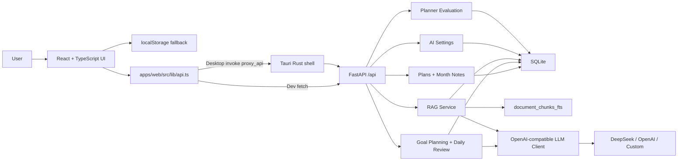
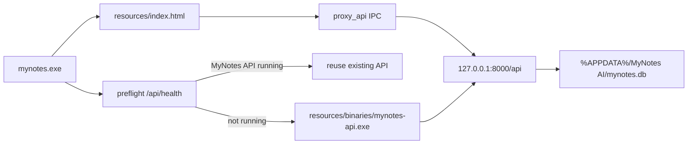

<p align="center">
  <br>
  <strong>MyNotes AI</strong>
  <br>
  <span>AI learning planner · daily review loop · local RAG · Windows desktop app</span>
  <br><br>
  
  
  
  
  
</p>

## 中文介绍

**MyNotes AI** 是一个面向学习、求职和长期目标管理的 AI 规划系统。它把长期目标输入、资料沉淀、AI 拆解、日程执行、每日复盘、重排预览、资料问答和质量评测连接成一个完整闭环。

这个项目不是单纯的日历页面，也不是只会调用 API 的聊天框。它展示的是一个可运行、可解释、可打包的 AI 应用：前端负责计划与交互，FastAPI 负责业务 API 和 SQLite 数据层，RAG 使用 SQLite FTS5/BM25，本地资料可以被检索并作为规划参考，桌面端通过 Tauri + PyInstaller sidecar 发布为 Windows MSI。

## English

**MyNotes AI** is an AI planning and review system for learning, job search, and long-term goal management. It connects goal planning, local knowledge grounding, calendar execution, daily reviews, replan previews, material Q&A, and deterministic planner evaluation.

The project is designed as a portfolio-grade AI full-stack application. It uses React + TypeScript + Vite on the frontend, FastAPI on the backend, SQLite for local storage and FTS5/BM25 retrieval, a DeepSeek-first OpenAI-compatible LLM client, and a Tauri desktop shell with a PyInstaller FastAPI sidecar.

## Current Status

| Item | Status |
| --- | --- |
| Version | `1.1.4` |
| Web app | React + TypeScript + Vite |
| Backend | FastAPI + SQLite |
| RAG | SQLite FTS5/BM25 with citations |
| AI | DeepSeek-first OpenAI-compatible client with mock fallback |
| Desktop | Tauri v2 + `mynotes-api.exe` sidecar |
| Installer | `release/MyNotes-AI-v1.1.4-windows-x64.msi` |
| Next | Desktop polish, auto-update, signing, and portfolio presentation |

## Features

| Module | Description |
| --- | --- |
| Calendar planning | Daily tasks with time, status, completion notes, and AI/manual source |
| Month notes | Monthly notes persisted locally and through FastAPI |
| Goal planning | Long-term goal -> phases -> today tasks |
| Daily review | Persisted daily summary based on completed and unfinished plans |
| Replan preview | AI suggestions stay as preview until the user applies them |
| Knowledge base | Save pasted JDs, notes, interview materials, or project context |
| TXT/MD upload | Upload `.txt` and `.md` files into the same RAG pipeline |
| FTS5/BM25 RAG | Chunk local materials, search with SQLite FTS5, rank with BM25 |
| Citations | Return document title, chunk, score, and chunk index |
| Planner evaluation | Deterministic six-dimension score without LLM calls |
| AI settings | Provider, base URL, model, key presence, temperature, and timeout |
| Desktop runtime | Bundled web UI + FastAPI sidecar + local SQLite user data |

## Tech Stack

| Layer | Stack |
| --- | --- |
| Frontend | React 18, TypeScript, Vite, lucide-react, Tauri JS API |
| Desktop | Tauri v2, Rust, WebView2, IPC command `proxy_api` |
| Backend | FastAPI, Pydantic, httpx, Uvicorn |
| Database | SQLite, FTS5 virtual table, BM25 ranking |
| Packaging | PyInstaller sidecar, Tauri MSI, PowerShell scripts |
| Tests | Pytest, Vitest, ESLint, TypeScript build, Cargo check |

## Architecture



Desktop runtime:



More details:

- [Architecture](docs/architecture.md)
- [Desktop Packaging Notes](docs/desktop.md)

## Project Structure

```text
apps/
  web/                React + TypeScript + Vite frontend
  desktop/            Tauri v2 desktop shell
backend/
  app/
    routers/          FastAPI routers
    services/         planning, RAG, AI settings, LLM, evaluator
    db.py             SQLite schema and connection
    desktop_paths.py  desktop user-data path resolution
scripts/
  build-web.ps1
  build-backend.ps1
  build-release.ps1
  smoke-test-installed.ps1
  verify-msi-user-path.ps1
  test-deepseek-real.ps1
docs/
  architecture.md
  desktop.md
release/
  MyNotes-AI-v1.1.4-windows-x64.msi
  MyNotes-AI-v1.1.4-windows-x64.sha256
```

## Run Locally

Backend:

```powershell
python -m venv .venv
.\.venv\Scripts\activate
pip install -r requirements.txt
uvicorn backend.app.main:app --reload
```

Frontend:

```powershell
cd apps\web
npm.cmd install
npm.cmd run dev
```

Open:

```text
http://127.0.0.1:5173
```

## Desktop MSI

Expected release files:

```text
release/MyNotes-AI-v1.1.4-windows-x64.msi
release/MyNotes-AI-v1.1.4-windows-x64.sha256
```

Installed layout:

```text
H:\mynotes\
  mynotes.exe
  resources\
    index.html
    assets\
    binaries\
      mynotes-api.exe
```

Normal users only install the MSI and open `MyNotes AI`. They should not install Node/Python/Rust, run `mynotes-api.exe` manually, or set `MYNOTES_SKIP_SIDECAR`.

In the MSI build, frontend API calls go through the Tauri `proxy_api` IPC command. This avoids WebView2 mixed-content blocking and keeps production access independent from browser CORS. TXT/MD uploads also use the JSON RAG API through this proxy in desktop mode.

Build a release package:

```powershell
.\scripts\check-packaging-toolchain.ps1
.\scripts\build-release.ps1 -Version 1.1.4
```

If startup fails, check:

```text
%APPDATA%\MyNotes AI\logs\desktop.log
```

## AI Configuration

Recommended DeepSeek settings:

```text
Provider: DeepSeek
Base URL: https://api.deepseek.com
Chat endpoint: /chat/completions
Default model: deepseek-v4-flash
Optional model: deepseek-v4-pro
```

The DeepSeek URL builder must produce:

```text
https://api.deepseek.com/chat/completions
```

It must not produce:

```text
https://api.deepseek.com/v1/chat/completions
```

API keys are saved locally but never returned by `GET /api/ai/settings`; the public response only exposes `hasApiKey`. Saving settings with a blank key clears the stored key. Empty or legacy cached keys never fall back to environment variables and do not count as configured; re-enter the key once after upgrading if you intentionally saved one before this fix. Logs must never include a full key.

DeepSeek v4/reasoning-style models need enough output budget even for connection tests. Empty LLM message content is treated as an error, not a successful response, so the app can fall back or show a clear failure instead of silently saving a false success state.

Manual real DeepSeek test:

```powershell
$env:DEEPSEEK_API_KEY="your-key"
$env:USE_REAL_LLM="1"
.\scripts\test-deepseek-real.ps1
```

## Verify

Backend:

```powershell
python -m compileall backend
.\.venv\Scripts\python.exe -m pytest backend\tests
```

Frontend:

```powershell
cd apps\web
npm.cmd run lint
npx.cmd tsc -b
npm.cmd run test
npm.cmd run build
```

Desktop:

```powershell
.\scripts\check-desktop-config.ps1
.\scripts\check-packaging-toolchain.ps1
cd apps\desktop
cargo fmt
cargo check
npm.cmd run build
```

Full release:

```powershell
.\scripts\build-release.ps1 -Version 1.1.4
.\scripts\smoke-test-installed.ps1
.\scripts\verify-msi-user-path.ps1 -InstalledDir "H:\mynotes"
```

In restricted sandbox environments, Vite/esbuild can fail to read `vite.config.ts` even when `lint` and `tsc -b` pass. Run the build from a normal PowerShell terminal if that happens.

## API Summary

| Endpoint | Purpose |
| --- | --- |
| `GET /health` | Simple health check |
| `GET /api/health` | Desktop-aware health check with `status`, `app`, `pid`, `version` |
| `GET /api/plans?date=YYYY-MM-DD` | List daily plans |
| `POST /api/plans` | Create plan |
| `PATCH /api/plans/{id}` | Update plan |
| `DELETE /api/plans/{id}` | Delete plan |
| `GET /api/month-notes` | Read month note |
| `PUT /api/month-notes` | Save month note |
| `GET /api/ai/settings` | Read public model settings without exposing key |
| `PUT /api/ai/settings` | Save provider/model/base URL/key settings |
| `POST /api/ai/test` | Test mock or configured model |
| `POST /api/planning/goal-plan` | Generate and persist goal plan |
| `POST /api/planning/daily-review` | Generate and persist daily review |
| `GET /api/planning/daily-review` | Read saved daily review or an empty saved state |
| `POST /api/planning/replan/apply` | Apply replan preview tasks |
| `POST /api/rag/documents` | Save pasted material |
| `POST /api/rag/documents/upload` | Upload TXT/MD material |
| `GET /api/rag/documents` | List RAG documents |
| `DELETE /api/rag/documents/{id}` | Delete document and chunks |
| `POST /api/rag/query` | Query local RAG with citations |
| `POST /api/eval/planner` | Deterministic planning quality evaluation |

## Resume Pitch

独立开发 **MyNotes AI** 学习规划系统，基于 React + TypeScript + Vite 构建前端，使用 FastAPI + SQLite 实现本地数据层，支持日程管理、目标拆解、日报复盘、重排预览、资料库问答、TXT/MD 文件上传、偏好记忆、模型配置和规划质量评测。实现 DeepSeek-first 的 OpenAI-compatible LLM client，并保留 mock fallback；基于 SQLite FTS5/BM25 构建本地 RAG 检索能力，对资料进行切片、索引、Top-K 召回和引用来源展示；补齐 Tauri 桌面壳、FastAPI sidecar、Windows MSI 构建脚本、启动健康检查和桌面 IPC 代理，形成可展示、可安装、可讲解的 AI 全栈作品。

## Documentation Maintenance

`README.md`、`AGENTS.md`、`CLAUDE.md` 必须随着项目自动维护。只要修改版本、架构、功能、API、环境变量、AI 策略、数据库、启动方式、打包流程、截图或作品集定位，就要同步更新这三个文件。

## License

MIT
