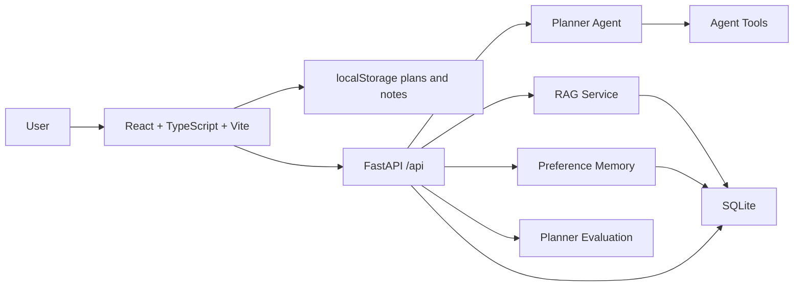

<p align="center">
  <br>
  <strong>MyNotes AI</strong>
  <br>
  <span>AI 学习规划、日程复盘与个人资料问答系统</span>
  <br>
  <span>An AI planning, review, and personal knowledge assistant.</span>
  <br><br>
  
  
  
  
</p>

---

## 中文

**MyNotes AI** 是一个面向学习、求职和长期目标管理的 AI 全栈项目。它从原来的本地日程工具升级为 React + TypeScript 前端和 FastAPI 后端，覆盖日历计划、完成记录、月备注、AI 目标拆解、动态复盘、资料 RAG 问答、偏好记忆、Agent 工具定义和规划质量评估。

这个项目的定位是作品集项目，而不是简单页面练习：前端展示现代工程化能力，后端展示 AI 应用开发常见能力，README 和架构文档则用于让面试官快速理解项目价值。

### 重要说明

入口文件已经改为 **`MyNotes.html`**。

这是 Vite + React + TypeScript 项目，完整应用需要通过开发服务器或构建产物运行。直接双击 `MyNotes.html` 时，页面会显示启动说明，不会再空白；要看到完整应用，请运行：

```bash
npm install
npm run dev
```

然后打开：

```text
http://127.0.0.1:5173/MyNotes.html
```

### 核心功能

| 模块 | 说明 |
| --- | --- |
| 日历计划 | 按日期管理任务，支持时间、完成状态、完成记录和月备注。 |
| AI 目标拆解 | 输入长期目标、截止日期和每日可用时间，生成阶段计划与今日任务。 |
| 动态复盘 | 根据当天完成情况生成复盘建议，帮助调整后续安排。 |
| RAG 问答 | 粘贴 JD、课程资料、面经或个人基础，检索相关片段并生成建议。 |
| 偏好记忆 | 保存用户学习节奏，例如上午深度学习、晚上复盘。 |
| Agent 工具 | 暴露 `create_task`、`search_materials`、`summarize_week` 等工具定义。 |
| 质量评估 | 用测试案例评估计划的可执行性、时间感、上下文和复盘闭环。 |
| 工程化 | Vite、TypeScript、ESLint、Vitest、GitHub Actions、Docker、架构文档。 |

### 技术栈

| 层 | 技术 |
| --- | --- |
| 前端 | React 18、TypeScript、Vite、lucide-react |
| 样式 | 自定义 CSS、Apple HIG 风格、本地响应式布局 |
| 后端 | FastAPI、Pydantic、SQLite |
| AI | Agent-style planner、RAG、Memory、Eval、mock fallback |
| 工程化 | ESLint、Vitest、GitHub Actions、Docker |

### 架构



更多说明见 [docs/architecture.md](docs/architecture.md)。

### 启动后端

```bash
pip install -r requirements.txt
uvicorn backend.app.main:app --reload
```

前端开发环境会把 `/api` 代理到 `http://127.0.0.1:8000`。没有 API key 时，后端默认返回 mock 结果，仍然可以完整演示 AI 流程。

### 环境变量

复制 `.env.example` 后按需配置：

```bash
AI_PROVIDER=mock
AI_API_KEY=
AI_API_BASE=https://api.deepseek.com
AI_MODEL=deepseek-chat
DATABASE_URL=sqlite:///./data/mynotes.db
```

### API

| 接口 | 作用 |
| --- | --- |
| `POST /api/agent/plan` | 生成阶段计划与今日任务 |
| `POST /api/agent/review` | 根据完成情况生成复盘 |
| `GET /api/agent/tools` | 查看 Agent 工具定义 |
| `POST /api/rag/ingest` | 写入资料切片 |
| `POST /api/rag/query` | 基于资料做检索问答 |
| `POST /api/memory/preferences` | 保存用户偏好 |
| `POST /api/eval/planner` | 运行规划质量评估 |

### 项目结构

```text
MyNotes/
├── MyNotes.html
├── package.json
├── vite.config.ts
├── tsconfig.json
├── eslint.config.js
├── requirements.txt
├── Dockerfile
├── docs/
│   └── architecture.md
├── backend/
│   └── app/
│       ├── main.py
│       ├── schemas.py
│       ├── db.py
│       └── services/
│           ├── planner.py
│           ├── rag.py
│           ├── memory.py
│           ├── evaluator.py
│           └── tools.py
└── src/
    ├── App.tsx
    ├── main.tsx
    ├── styles.css
    ├── components/
    ├── lib/
    └── utils/
```

### 简历写法

> 独立开发 MyNotes AI 学习规划系统，基于 React + TypeScript + Vite 构建前端，使用 FastAPI 提供 AI 应用后端；支持日程管理、长期目标拆解、动态复盘、资料 RAG 问答、用户偏好记忆和规划质量评估。封装 Agent 工具定义，设计 mock fallback 保证无 API key 时可完整演示，并通过 Docker 与 GitHub Actions 完成工程化部署准备。

---

## English

**MyNotes AI** is an AI planning and review system for learning, job search, and long-term goal management. It upgrades a local planner into a React + TypeScript frontend and FastAPI backend with calendar planning, completion records, AI goal decomposition, dynamic review, RAG over materials, preference memory, Agent tools, and planner evaluation.

The entry file is **`MyNotes.html`**. Because this is a Vite + React + TypeScript project, the full app should run through the dev server or production build output:

```bash
npm install
npm run dev
```

Open:

```text
http://127.0.0.1:5173/MyNotes.html
```

Run the backend:

```bash
pip install -r requirements.txt
uvicorn backend.app.main:app --reload
```

Mock mode works without an API key, so the full AI workflow remains demoable.

## License

MIT
