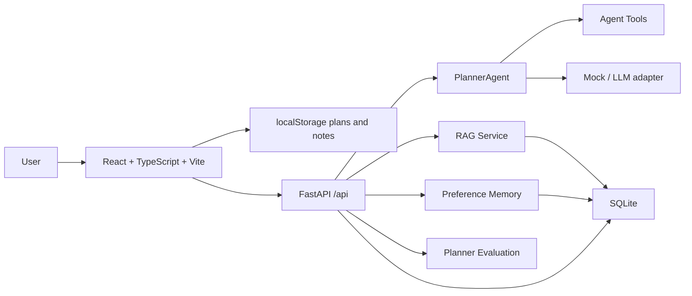

# MyNotes AI Architecture

## Why This Architecture

- React + TypeScript shows modern frontend engineering instead of only DOM scripting.
- FastAPI separates AI workflows from the UI and makes the project easier to deploy.
- RAG, Memory, Agent tools and Eval map directly to AI application internship keywords.
- Mock mode keeps the demo stable without requiring a paid API key.

## Interview Talking Points

- How local-first planning data differs from backend AI event data.
- How pasted materials become retrievable chunks.
- How preference memory changes planning rhythm.
- How evaluation cases can be expanded into a real quality benchmark.
