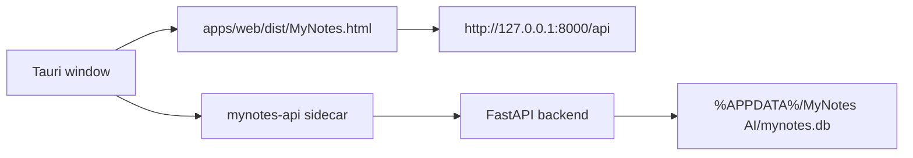

# MyNotes AI Desktop Packaging Notes

Phase 7 prepares the desktop shell and sidecar packaging structure. It does not produce the final Windows installer yet.

## Target Shape



The release app should bundle:

- The built web frontend from `apps/web/dist`
- The backend sidecar binary named `mynotes-api`
- A Tauri window named `MyNotes AI`

## Environment Contract

| Variable | Default | Meaning |
| --- | --- | --- |
| `MYNOTES_ENV` | unset | Set to `desktop` for packaged desktop mode |
| `MYNOTES_API_PORT` | `8000` | Port used by the FastAPI sidecar |
| `MYNOTES_DB_PATH` | unset | Optional explicit SQLite path |

When `MYNOTES_ENV=desktop`, the backend resolves SQLite to:

```text
%APPDATA%\MyNotes AI\mynotes.db
```

If `MYNOTES_DB_PATH` is set, it wins over the desktop default.

## Required Toolchain For Phase 8

Install these before attempting a real installer build:

1. Node.js 20+
2. Python 3.11+
3. Rust and Cargo from rustup
4. Microsoft Visual Studio Build Tools with C++ desktop workload
5. Tauri CLI for `apps/desktop`
6. PyInstaller inside `.venv`
7. Microsoft Edge WebView2 Runtime

## Development Mode

```powershell
.\scripts\dev-desktop.ps1
cd apps\desktop
npm install
npm run dev
```

Development mode loads:

```text
http://127.0.0.1:5173/MyNotes.html
```

The web app can still run without Tauri:

```powershell
uvicorn backend.app.main:app --reload
cd apps\web
npm run dev
```

## Build Preparation

Build the web app:

```powershell
.\scripts\build-web.ps1
```

Build the backend sidecar:

```powershell
.\scripts\build-backend.ps1
```

The backend script expects PyInstaller. If PyInstaller is missing, it prints the exact install command instead of failing silently.

Poll the sidecar health endpoint:

```powershell
.\scripts\wait-api-health.ps1 -Url http://127.0.0.1:8000/api/health
```

Run the static desktop check:

```powershell
.\scripts\check-desktop-config.ps1
```

## Phase 8 Checklist

- Install Rust/Cargo and verify `cargo --version`.
- Install Tauri CLI and verify `npx tauri --version`.
- Install PyInstaller in `.venv`.
- Build `mynotes-api-x86_64-pc-windows-msvc.exe` into `apps/desktop/src-tauri/binaries`.
- Run `npm run build` from `apps/desktop`.
- Attach the generated installer and checksum to a GitHub Release.
