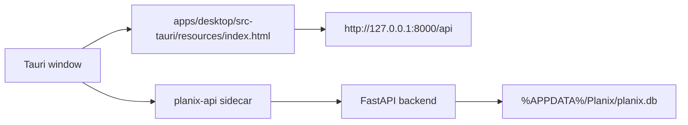

# Planix Desktop Packaging Notes

Planix packages a React/Vite frontend and a FastAPI backend sidecar into a Windows desktop app through Tauri. These notes describe the intended installer experience and local packaging flow.

The portfolio-facing documentation version is `v3.0.0`. It is a presentation label for documentation and release naming, not a package or backend version bump by itself.

## Target Shape



The release app should bundle:

- The built web frontend copied into `apps/desktop/src-tauri/resources`.
- The backend sidecar binary named `planix-api`.
- A Tauri window named `Planix`.

## Normal User Install

Normal users should download the Setup.exe installer first:

```text
Planix-v3.0.0-windows-x64-setup.exe
```

The MSI is kept as a backup or enterprise installer:

```text
Planix-v3.0.0-windows-x64.msi
```

Checksum files are for verification only:

```text
Planix-v3.0.0-windows-x64-setup.exe.sha256
Planix-v3.0.0-windows-x64.msi.sha256
```

Users should not download `Source code.zip` as the installer, run `planix-api.exe` directly, open `.sha256` checksum files as installers, or set `$env:PLANIX_SKIP_SIDECAR="1"`. After installation, open `Planix` from the Windows Start menu.

The app bundles the frontend and the FastAPI sidecar. Users do not need Node.js, Python, Rust, Cargo, npm, pip, or a command line. Basic local features work immediately. AI features require the user to enter their own DeepSeek-compatible API key inside the app.

The installed directory is expected to look like this:

```text
Planix\
  planix.exe
  resources\
    index.html
    assets\
    binaries\
      planix-api.exe
```

If a user sees `asset not found: index.html`, the installer was built incorrectly or is missing frontend assets. Rebuild and reinstall the latest Setup.exe.

## Environment Contract

| Variable | Default | Meaning |
| --- | --- | --- |
| `PLANIX_ENV` | unset | Set to `desktop` for packaged desktop mode |
| `PLANIX_API_PORT` | `8000` | Port used by the FastAPI sidecar |
| `PLANIX_DB_PATH` | unset | Optional explicit SQLite path |

When `PLANIX_ENV=desktop`, the backend resolves SQLite to:

```text
%APPDATA%\Planix\planix.db
```

If `PLANIX_DB_PATH` is set, it wins over the desktop default.

## Required Toolchain

Install these before attempting a real local installer build:

1. Node.js 20+
2. Python 3.11+
3. Rust and Cargo from rustup
4. Microsoft Visual Studio Build Tools with C++ desktop workload
5. Tauri CLI through `apps/desktop/package.json`
6. PyInstaller from `requirements-build.txt`
7. Microsoft Edge WebView2 Runtime

Check the local packaging toolchain:

```powershell
.\scripts\check-packaging-toolchain.ps1
```

## Development Mode

```powershell
.\scripts\dev-desktop.ps1
cd apps\desktop
npm install
npm run dev
```

Development mode loads:

```text
http://127.0.0.1:5173
```

The web app can still run without Tauri:

```powershell
uvicorn backend.app.main:app --reload
cd apps\web
npm run dev
```

## Build Preparation

Build the web app:

```powershell
.\scripts\build-web.ps1
```

Build the backend sidecar:

```powershell
.\scripts\build-backend.ps1
```

The backend script installs `requirements.txt` and `requirements-build.txt`, then packages `planix-api.exe` with PyInstaller. The sidecar copied into the installer resources must be named:

```text
apps/desktop/src-tauri/resources/binaries/planix-api.exe
```

Poll the sidecar health endpoint:

```powershell
.\scripts\wait-api-health.ps1 -Url http://127.0.0.1:8000/api/health
```

Run the static desktop check:

```powershell
.\scripts\check-desktop-config.ps1
```

## Build The Release Package

```powershell
.\scripts\build-release.ps1 -Version 3.0.0
```

Expected portfolio release outputs:

```text
release/Planix-v3.0.0-windows-x64-setup.exe
release/Planix-v3.0.0-windows-x64-setup.exe.sha256
release/Planix-v3.0.0-windows-x64.msi
release/Planix-v3.0.0-windows-x64.msi.sha256
```

Publish locally with the official GitHub CLI after the build succeeds:

```powershell
gh.exe auth status
.\scripts\build-release.ps1 -Version 3.0.0 -CreateGitHubRelease
```

The project also includes `.github/workflows/desktop-release.yml`. Pushing a `v*` tag or manually running the workflow builds the Windows installers and uploads the Setup.exe, backup MSI, and their SHA256 checksum files to GitHub Release.

## Manual Acceptance

- Install `Planix-v3.0.0-windows-x64-setup.exe`.
- Open `Planix`.
- Confirm the web UI loads.
- Confirm the FastAPI sidecar responds on `/api/health`.
- Try calendar, goal planning, RAG query, TXT/MD material flow, planner evaluation, Runtime trace, and P Mode.
- Close the app and confirm every `planix-api` sidecar process exits, including the PyInstaller parent/child process tree.

Run the installed-app smoke test:

```powershell
.\scripts\smoke-test-installed.ps1
```

The smoke test starts the installed app and checks `http://127.0.0.1:8000/api/health`. If it fails, check `%APPDATA%\Planix\logs\desktop.log`.

## Common Failures

| Symptom | Fix |
| --- | --- |
| `cargo` or `rustc` missing | Install Rust with rustup and reopen the terminal |
| `PyInstaller` missing | Run `.\.venv\Scripts\python.exe -m pip install -r requirements-build.txt` |
| `tauri` missing | Run `cd apps\desktop; npm.cmd install` |
| `gh.ps1` blocked | Use official `gh.exe`, or publish through GitHub Actions |
| Setup.exe missing | Check `apps/desktop/src-tauri/target/release/bundle/nsis` and rerun the release build |
| MSI missing | Check `apps/desktop/src-tauri/target/release/bundle/msi` and rerun the release build |
| `asset not found: index.html` | Rebuild with `.\scripts\build-release.ps1 -Version 3.0.0`; `apps/web/dist/index.html` must exist |
| App opens but API is unavailable | Check port `8000`, sidecar file, and `%APPDATA%\Planix\logs\desktop.log` |

## Historical Notes

Older release notes under `docs/release-v*.md` are retained as historical records. They are not the current portfolio-facing documentation version.

## Packaging Roadmap

- Code signing for Windows releases.
- Tauri auto-update.
- Desktop-specific empty/loading/error states.
- Real release screenshots and portfolio demo assets.
